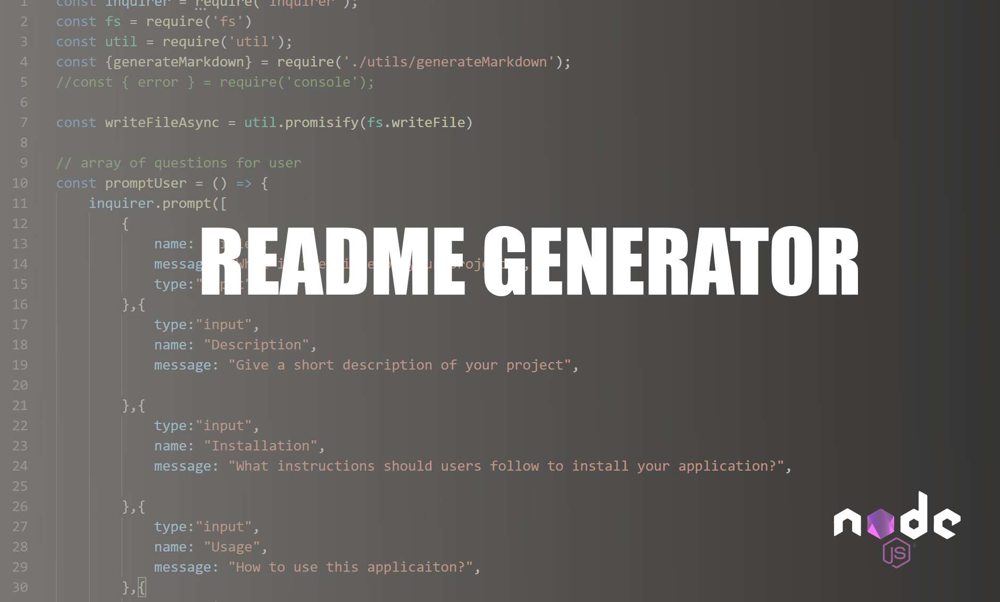

## readme-gen
A command-line application that generates README's based on user input.
  
  
  
  
  ## Table of Contents
  1. [Installation](#Installation)
  2. [Usage](#Usage)
  3. [Video](#Video)
  4. [License](#License)
  5. [Contributing](#Contributing)
  6. [Questions](#Questions)
  
  ## Installation 
  Clone this repository by clicking on the green button that says 'Code'
  
  ## Usage
  Invoke the applicaton with the command 
  
  > node index.js 
  
  Answer the prompts that appear in the command line. After completing this step, this message will appear in the terminal: "Successfully wrote to README.md!"
  If there is an error, an error message will appear in the terminal. 
  
  The README.md file will then be generated based on user input and should appear in the file structure.
  
  ## Video
  
  Watch the demo video
  
  [README GENERATOR](https://youtu.be/xlB12EdwFpU "README GENERATOR")

  

  
  
  ## License
  This project operates under the MIT license
  
  
  
  ## Contributing 
  Contributions are welcome
  
  ## Questions
  
  GITHUB: https://github.com/angeleefshaw
  EMAIL: angeleefshaw@gmail.com
  LINKEDIN: https://www.linkedin.com/in/angelee-shaw-2a65861bb/
  
